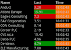

# Lightstreamer - Basic Stock-List Demo - Android Client #

This project contains a full example of a Java Swing application that employs the Lightstreamer Android Client library.

<table>
  <tr>
    <td style="text-align: left">
      &nbsp;&nbsp;
    </td>
    <td>
      &nbsp;&nbsp;
    </td>
  </tr>
</table>

This is a Java-for-Android version of the [Lightstreamer - Basic Stock-List Demo - HTML client](https://github.com/Weswit/Lightstreamer-example-StockList-client-javascript#basic-stock-list-demo---html-client). 
This app uses the <b>Android Client API for Lightstreamer</b> to handle the communications with Lightstreamer Server. A simple user interface is implemented to display the real-time data received from Lightstreamer Server. 

## Dig the code ##
The application is divided into 6 main classes.
* <b>AndroidUi.java</b>: this class handles the communication to the final Android user interface, like connection status and items updates.
* <b>LightstreamerListener.java</b>: it's the interface implemented by AndroidUi, that receives both data and connection events from the Lightstreamer Client.
* <b>StockListConnectionListener.java</b>: it's the Lightstreamer ConnectionListener implementation that is passed to LSClient for receiving connection-related events. In this project, this object routes all the events to LightstreamerListener.
* <b>StocklistHandyTableListener.java</b>: it's the Lightstreamer HandyTableListener implementation that is passed to LSClient for receiving data-related events. In this project, this object routes all the events to LightstreamerListener. 
* <b>LightstreamerClient.java</b>: it's a wrapper class that encapsulates the Lightstreamer LSClient object, exposting start() and stop() methods.
* <b>StockListDemo.java</b>: the class containing the Android activity entry point, from where Lightstreamer client <-> server connection and Android User Interface (AndroidUi) is initialized.
  
Check out the sources for further explanations.
  
<i>NOTE: not all the functionalities of the Lightstreamer Android Java client are exposed by the classes listed above. You can easily expand those functionalities using the [Android Client API](http://www.lightstreamer.com/docs/client_android_api/index.html) as a reference. If in trouble check out the [specific Lightstreamer forum](http://forums.lightstreamer.com/forumdisplay.php?33-Android-Client-API).</i>

# Build #

If you want to skip the build and deploy processes of this demo please note that you can install the app from the Android Market, you can use the QR code abover or visit the corresponding [Android Market page](https://market.android.com/details?id=com.lightstreamer.demo.android).
 
Otherwise, if you want to procede with the compilation of own version of this demo please consider that this example is comprised of the following folders:
* /src 
  Contains the sources to build the Java-for-Android application.

* /res 
  Contains the images and other resourced needed to the demo.
  
* /lib 
  Drop here the ls-android-client.jar from the Lighstreamer SDK for Android Clients, to be used for the build process.
  
## Getting started ##
To directly import the project as is you need the Eclipse IDE with the Android SDK and Android ADT plugin installed: Go to [http://www.eclipse.org/](http://www.eclipse.org/) and download the latest Eclipse distribution in its "classic" package. 
Go to http://developer.android.com/sdk/ and follow the instructions to install the Android SDK and ADT plugin in Eclipse.
You may want to read more detailed information regarding the required ADT Eclipse plugin, including choosing the best version for your IDE, at: [http://developer.android.com/sdk/eclipse-adt.html](http://developer.android.com/sdk/eclipse-adt.html).
<i>NOTE: You may also use the sources of the demo with another IDE or without any IDE but such approach is not covered in this readme. In any case you need at least the Android SDK.</i>
 

You're now ready to import the project into eclipse, click on File->Import... then under General select Existing Projects into Workspace and choose the folder where the demo sources are.

## Compile and Run ##
From Eclipse, to compile and run the application right-click on the project in the Package Explorer and click Run As -> Android Application. If this is the first time an Android application is run, an extra window will appear asking to create a new Android Emulator Device "Android SDK and AVD Manager".
In this case, click on the "New..." button on the right and fill the form entering a name for your Android emulated device, a target platform of your choice and a SD card size. If you are unsure, select Android 1.1 as target platform and 128Mb as SD card size. Once done, click the "Create AVD" button and close the "Android SDK and AVD Manager window" clicking on the "X" title-bar button. At this point, your Android demo is compiled and executed inside the newly created Android emulator device.

# Deploy #
  
You may run the demo against your local server or using our online server at http://push.lightstreamer.com:80. The server to which the demo will connect to is configured in the res/values/strings.xml file.
In the former case, the example requires that the [QUOTE_ADAPTER](https://github.com/Weswit/Lightstreamer-example-Stocklist-adapter-java) and [LiteralBasedProvider](https://github.com/Weswit/Lightstreamer-example-ReusableMetadata-adapter-java) have to be deployed in your local Lightstreamer server instance. 
The factory configuration of Lightstreamer server already provides this adapter deployed. 

# See Also #

## Lightstreamer Adapters needed by this demo client ##

* [Lightstreamer - Stock-List Demo - Java Adapter](https://github.com/Weswit/Lightstreamer-example-Stocklist-adapter-java)
* [Lightstreamer - Reusable Metadata Adapters - Java Adapter](https://github.com/Weswit/Lightstreamer-example-ReusableMetadata-adapter-java)

## Similar demo clients that may interest you ##

* [Lightstreamer - Stock-List Demos - HTML Clients](https://github.com/Weswit/Lightstreamer-example-Stocklist-client-javascript)
* [Lightstreamer - Basic Stock-List Demo - jQuery (jqGrid) Client](https://github.com/Weswit/Lightstreamer-example-StockList-client-jquery)
* [Lightstreamer - Stock- List Demo Dojo Toolkit Client](https://github.com/Weswit/Lightstreamer-example-StockList-client-dojo)
* [Lightstreamer - Basic Stock-List Demo - .NET Client](https://github.com/Weswit/Lightstreamer-example-StockList-client-dotnet)
* [Lightstreamer - Round-Trip Demo - HTML Client](https://github.com/Weswit/Lightstreamer-example-RoundTrip-client-javascript)

# Lightstreamer Compatibility Notes #

- Compatible with Lightstreamer Android Client API v. 1.0.2 or newer.
- For Lightstreamer Allegro (+ Android Client API support), Presto, Vivace.
